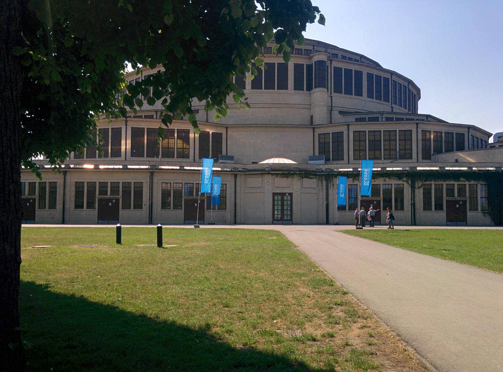
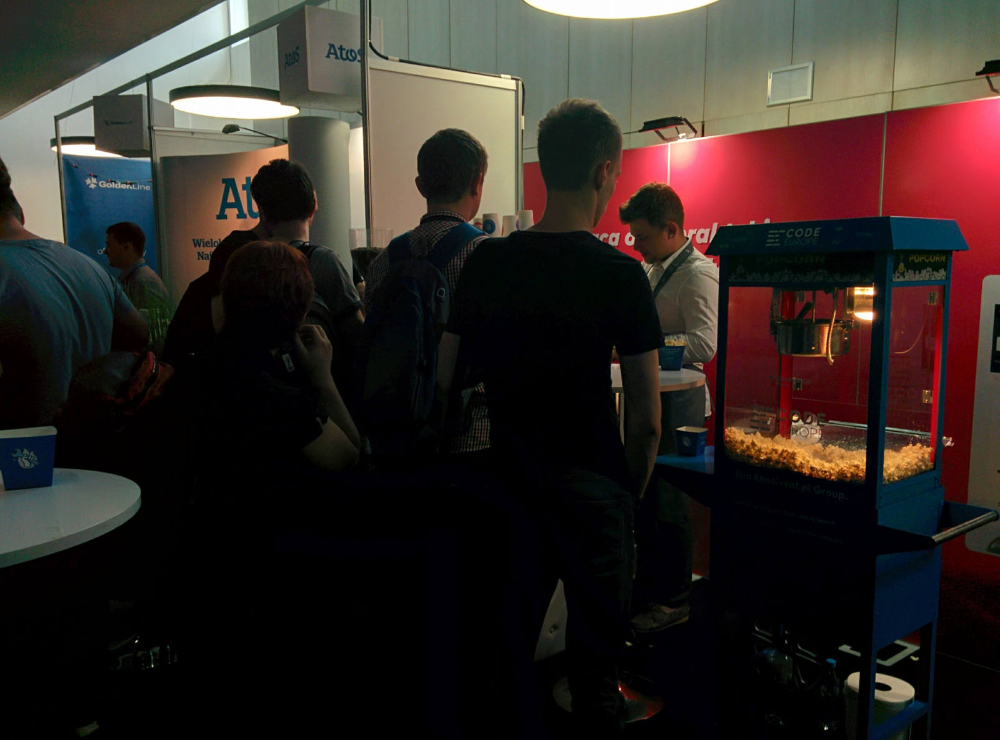
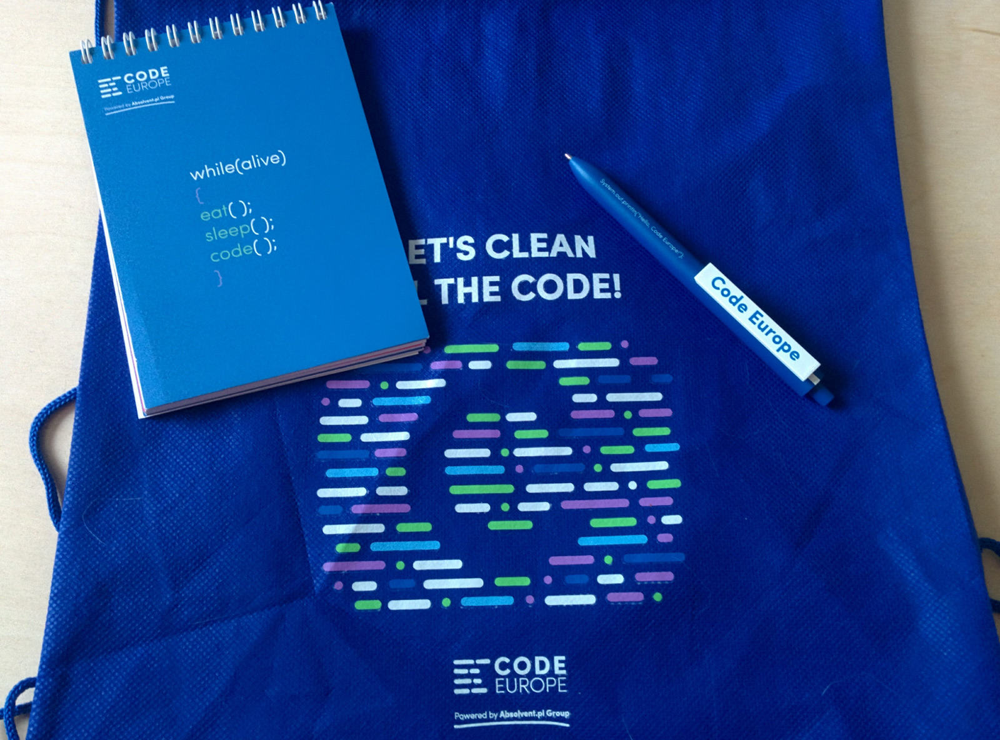

import { me, siteMetadata } from '@/lib/data';
import image from './image.jpg';

export const article = {
  date: '2017-05-26',
  title: 'Code Europe',
  description:
    'Podobno największa konferencja programistyczna w Polsce, ale czy najlepsza? Oto moja relacja z tego wydarzenia.',
  author: me,
  image,
  lang: 'pl'
};

export const metadata = {
  title: article.title,
  description: article.description,
  author: { name: article.author.name },
  ...siteMetadata,
  keywords: ['konferencja'],
};

# Code Europe

Podobno największa konferencja programistyczna w Polsce, ale czy najlepsza? Oto moja relacja z tego wydarzenia.

## Przed
Nie pamiętam jak dowiedziałem się o Code Europe. Szczerze to na początku uważałem tą konferencje jako jakiś scam, głównie ze względu na kampanię marketingową jaką prowadzą. Wydaje się taka sztuczna i pusta. Nie planowałem się tam udać, ale dobry termin, lokacja i przede wszystkim chęć zobaczenia czegoś nowego przekonały mnie do wydania tych 58 złotych.
Dotarcie na miejsce nie stanowiło problemu, choć kolejka do rejestracji była przerażająca. Było to rano więc nie było aż tak gorąco, ale i tak słońce mocno dawało się we znaki. To był pierwszy moment kiedy miałem wrażenie, że ilość ludzi jest przytłaczająca.

## W trakcie

## Miejsce
Miejsce w jakim odbywała się konferencja to Hala Stulecia we Wrocławiu. Ładna, pełna zieleni okolica, wycieczki emerytowanych Niemców i nowoczesne wnętrze. Dodatkowo, przypadkowo lub nie — food trucki, dobra opcja na obiad, bo na samej konferencji ciężko było z jedzeniem. Duży plus za lokalizację.

### Ludzie i organizacja
Trudno mi tu coś powiedzieć. Ilość ludzi sprawiała, że trudno było podyskutować. Przy wejściach z sal tworzył się ruch wahadłowy, na wielu prezentacjach brakowało miejsc, kolejki były naprawdę pospolite. Na szczęście toaleta była wolna od tego problemu. Zatem czy naprawdę liczba miejsc jest ograniczona?
Pomijając ten aspekt brakowało mi jakiegoś kontaktu z organizatorami. Żadnego przywitania, pewnych wyjaśnień — np. nie tylko ja miałem wątpliwości co do położenia sali Seattle, bo aby do niej dotrzeć trzeba było użyć wyjątkowych schodów.

Popcorn i kawa, ciekawe połączenie jako przekąska. Tak, tutaj rozciągała się kolejka na kilometr.

### Firmy
W sumie standard, choć zauważyłem, że stoiska miały bardziej charakter formalny w porównaniu do confitury co oczywiście jest zrozumiałe, ale nie było znowu tak źle. Ja jako ktoś kto ma absolutne 0 w doświadczeniu formalnym dobrze się bawiłem rozmawiając z przedstawicielami.

> Ja: Dzień dobry, ja mam pytanie: co teraz robi Nokia?
> Pani: No na pewno nie telefony :)

To był dla mnie ciekawy trening umiejętności rozmawiania i wychodzenia ze swojej nieśmiałości.

### Prezentacje
Było w czym wybierać. 5 sal, prezentacje od 9 do nawet 18, sporo prezentacji w języku angielskim, kilka prowadzonych przez osoby z znanych firm m.in Spotify. Code Europe tematycznie nie jest sprecyzowany. Widziałem prezentacje w formie opowieści o losach w firmie, przemyśleń o urządzeniach IoT, wprowadzenia do technologii czy technicznej implemetacji wzorca w Androidzie. Każdy mógł znaleźć coś dla siebie. Mi osobiście prezentacje wydały się zbyt ogólne, oczywiste, ale niemniej miło się ich słuchało. Muszę się też przyznać do błędu, czyli do nie zaplanowania agendy.

## Po
Jak po confiturze miałem sporą motywację do nauki to tak po Code Europe nie mam takiej zajawki, ale to może wina tego, że i tak jestem już zapracowany (moje wakacje). Nie uważam jednak tego czasu za stracony, czuję że każda taka przygoda to krok do bycia odważniejszym i ciekawszym człowiekiem. Jeśli macie okazję zajrzyjcie na Code Europe, ale miejcie na uwadzę te drobne problemy. Ja wracam do kodu.

Stylowany notes, worek-plecak, długopis i nieobecna już woda i batonik.
