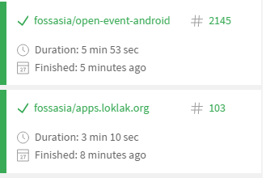

import { me, siteMetadata } from '@/lib/data';
import image from './ci.jpg';

export const article = {
  date: '2017-03-04',
  title: 'Continuous integration',
  description:
    'Continuous integration, czyli jak łatwiej pracować w grupie',
  author: me,
  image,
  lang: 'pl'
};

export const metadata = {
  title: article.title,
  description: article.description,
  author: { name: article.author.name },
  keywords: ['devops'],
  ...siteMetadata,
};

# Continuous integration
Continuous integration (pl. "Ciągła integracja") to praktyka gdzie
każdy członek zespołu/kontrybutor staje wysyła zmiany do repozytorium a
narzędzia CI mają sprawdzić czy aktualny kod dalej działa. Często te narzędzia
po sprawdzeniu czy kod działa wysyłają najnowszą wersję softu na produkcję, mówimy
wtedy o "deployment pipeline".

Dla programistów ciągła integracja to niewielka zmiana po prostu nie wrzucaj tony
kodu co tydzień tylko codziennie czy nawet co kilka godzin. Twórzmy program
równomiernie, liniowo.

## Po co?
### Naprawiajmy błędy jak najszybciej
Bugi się pojawiają i raczej nikt temu nie zaprzeczy. Pracując w zespole
zdarza się, że ktoś wprowadza błąd, który u niego nie jest jeszcze widoczny
ale u innych może się pojawić później. Dzięki CI bug zostanie złapany na
etapie w którym jeszcze kodu jest mało i jest on świeży, więc ktoś pamięta co
tam popsuł.

### Automatyzacja
Człowiek jest leniwy a szczególnie kiedy powtarza jakąś czynność np. odpalenie testów
przed commitem, wysłanie gotowego programu na serwer i tym podobne. Zatem zadaniem
narzędzi CI jest zrobienie tego za ciebie. Możesz się męczyć z konfiguracją godzinę, ale
za każdym razem jak robisz **git push** to oszczędzasz te 3 minuty. Do takiego
projektu łatwiej się wraca a satysfakcja z perfekcyjnej konfiguracji — bezcenna.

### "A u mnie działa"
Nawet pisząc kod Javy, która ma być dosyć odporna od rodzaju sprzętu,
systemu zdarza się, że u jednej osoby nie działa a u drugiej tak. W takich sytuacjach
trudno powiedzieć kto jest tym złym. Dajmy narzędziu zdecydować, jak u niego działa
to u was też musi.

### Dbanie o jakość kodu
Jenkins ma wiele pluginów do statycznej analizy kodu, code review i lintów.

Można by tak wymieniać...

### Jak?
Jeśli chodzi o projekt open-source to możemy skorzystać z [Travis CI](travis-ci.org).
Darmowy, łatwy do skonfigurowania i genialna integracja z GitHubem. Jedynymi problemami
może być prędkość z jaką będą się wykonywały zadania. Zdarzyło mi się, że build
failował, bo myślał, że testy UI na Androidzie się zawieszają.

*FOSSASIA stale buduje swoje projekty właśnie przez Travisa*

Jeśli chcemy mieć więcej możliwości (wysyłanie na produkcję etc.) to dobrym
i sprawdzonym rozwiązaniem jest [Jenkins](https://jenkins.io/). Na początku można
być lekko zdezorientowanym jeśli chodzi o konfiguracje, ale później staje się to
dziecinnie proste. Jenkins oferuje tonę pluginów i można go wykorzystać praktycznie
wszędzie (nawet w Pythonie, który się nie kompiluje).

*Jenkins wysyła moje Memes API na serwer, ja tylko robię pushe do GitHuba*

### Przyszłość
Narzędzia CI to aktualnie nie odrębna część workflow zespołu. Po prostu ciężko
jest bez tego żyć i pewnie ta sytuacja szybko się nie zmieni.

### Coś o Jenkinsie
Według [ThoughtWorks](https://www.thoughtworks.com/radar/tools) i ich
*Technology radar* należy być ostrożnym z używaniem Jenkinsa jako deployment pipeline.
Podobnie jest z AngularJS a ten może nie jest na topie, ale działa i jest łatwy w użyciu.

Mamy porzucić Jenkinsa? Nie, nie traktujmy ThoughtWorks jak wyroczni. Co nie oznacza, że
nie możemy spojrzeć na inne rozwiązania jak np. [GoCD](https://www.gocd.io/).

### EOF
Jeśli masz swoje doświadczenia z CI podziel się z nimi w komentarzu a jeśli nie tknąłeś
jeszcze tego tematu to bardzo gorąco Cię do tego zachęcam.
A teraz niech się stanie **kompletna automatyzacja!**
