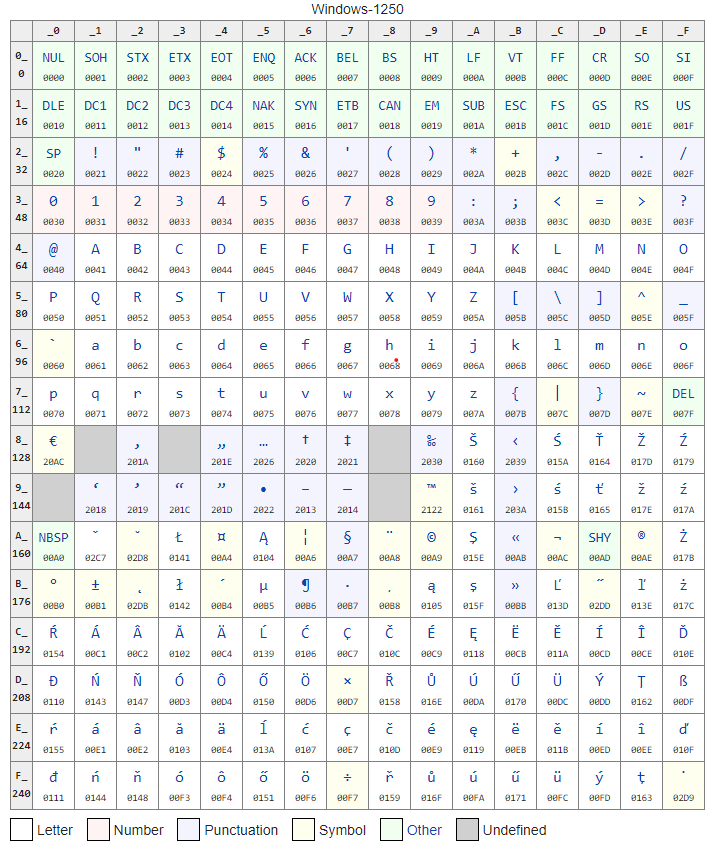

import imageAvatar from '@/images/avatar.jpg'

export const article = {
  date: '2020-04-15',
  title: 'Dart and character encodings',
  description:
    'Or how I solved a problem with missing encoding support for Dart',
  author: {
    name: 'Bartosz Wiśniewski',
    role: 'Fullstack Developer',
    image: { src: imageAvatar },
  },
}

export const metadata = {
  title: article.title,
  description: article.description,
  author: { name: article.author.name },
  themeColor: '#111827',
  keywords: ['dart', 'encoding', 'flutter', 'package'],
}

# Dart and character encodings

I work on an app that plans to use thermal printers. I am also a Stack Overflow user and I often hunt for interesting questions, especially regarding Flutter, so I saw this [question](https://stackoverflow.com/q/59475607/4698611):

> How to print Asian languages to a thermal printer from Flutter?

This seemed pretty easy. The package for printers just could not implement all different charsets that printers use. Just add support and voila! Well, it’s not that simple.

Windows-1250 code page was used for languages such as Polish, Czech, Slovak, Hungarian, Slovene, Bosnian or Croatian and does not exist in Dart

## Dart is missing a lot

You can love Dart, but the truth is that Dart is missing a lot of small features. We usually do get around them, but in this case — it’s really hard.
It turns out Dart does not come with support for many different encodings. It does have UTF-8, Latin1 (aka ISO-8859–1) and that’s all. Just a handful of Europeans can have their special characters encoded.

### Looking for solutions

The first things I noticed were packages for GBK support, which is the character encoding for simplified Chinese. These are usually implemented with a huge map of codes, which is absolutely fine. However, this approach does not work for every language. Some, because of their complexity, need to have a couple of characters for one position in line and besides that — I am not gonna do them all.

There was also a package that used binding to C code of iconv, a program for converting encodings, a GNU project. This approach is valid, but binding is still in beta and it’s not so straightforward to do, at least for me, someone who didn’t ever work with C. I tried to use it, but I didn’t work at all 😕
I also looked at how other languages do it. The web is a perfect example with iconv-lite package, a pure JS implementation. I actually tried to port it into Dart, which isn’t that different from modern JavaScript code, but it wasn’t easy especially since iconv-lite applies many optimizations, specific to JS.

## Platform

OK, a new idea, since Flutter, in the end, runs on some kind of platform, couldn’t we just use that? It turns out — yes and it’s a great option.
Android gives you Java, which has [Charset](https://docs.oracle.com/javase/7/docs/api/java/nio/charset/Charset.html) class that can be used for encoding. iOS has CFStringEncoding and functions around that. Only web is actually problematic, but we can use iconv-lite package to fix that.

Of course, this solution leads to a dependency on the platform, but in this case, it’s not that bad. Charsets names are globally defined, independent on the platform, with some aliases, and all the platform has to do is to get bytes in one end and output in the other. Although it could also be convenient to get a list of all available charsets.

## Solution

I got into this problem so deeply that I was encouraged to produce some results out of it. Since I had plenty of time during train travel I decided to create my first package — [charset_converter](https://pub.dev/packages/charset_converter). It’s not the fastest, not the best, but simple and good enough for most cases.

Since I got the thermal printer in the office I was also able to test my theory and answer mentioned Stack Overflow question and receive the bounty 😎

In the end, it was a good lesson and fun. I can also say that I somehow contributed to making Flutter more accessible for other cultures, cool isn’t?

Happy coding and stay tuned for the part where I describe how to publish your own package! 💙
