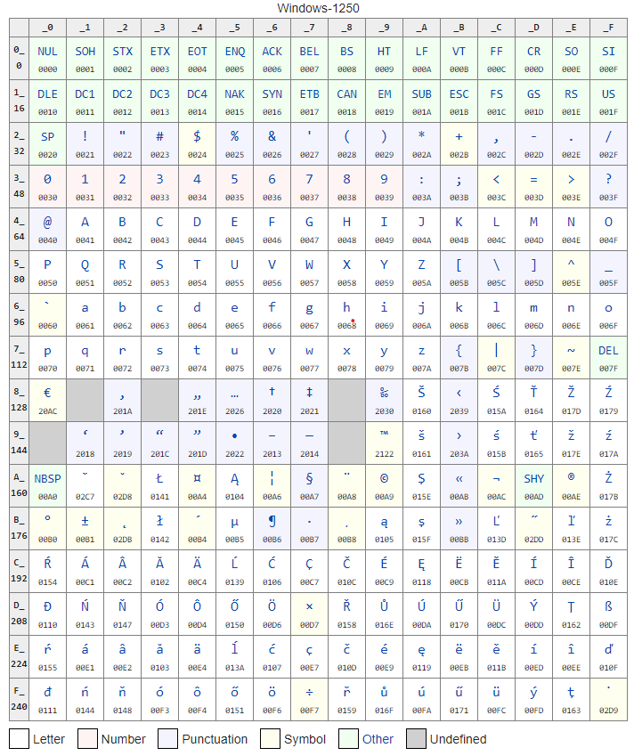

import { me, siteMetadata } from '@/lib/data';
import image from './image.jpg';

export const article = {
  date: '2020-03-10',
  title: 'Dart i zestawy znaków',
  description:
    'Analiza przypadku brakujących zestawów znaków i prób dostarczenia ich',
  author: me,
  image,
  lang: 'pl'
};

export const metadata = {
  title: article.title,
  description: article.description,
  author: { name: article.author.name },
  ...siteMetadata,
  keywords: ['flutter', 'dart'],
};

# Dart i zestawy znaków

Pracowałem nad aplikacją, która planowała wykorzystać drukarki termiczne. Jestem też aktywnym użytkownikiem Stack Overflow i często poluje na ciekawe pytania, zwłaszcza z tagu Fluttera i wtedy zobaczyłem [to pytanie](https://stackoverflow.com/q/59475607/4698611):
 
> How to print Asian languages to a thermal printer from Flutter?
 
Po krótkiej analizie paczki odpowiedź wydawała się dosyć prosta. Paczka do drukowania po prostu nie obsługuje wielu języków i trzeba ręcznie wysyłać bajty. Można też dodać po prostu wsparcie i voila! Cóż, gdyby to było takie proste to bym posta nie pisał.
 
## Dartowi wiele brakuje
Możesz kochać ten język, ale prawdą jest, że Dartowi brakuje wiele małych funkcji. Zwykle jakoś sobie radzimy, ale w tym przypadku jest to naprawdę trudne.
 
Okazuje się, że Dart nie wspiera wielu kodowań. Właśnie obsługuje tylko dwa: UTF-8 i Latin1, czyli ISO-8859–1. To oznacza, że obsłużonych jest tylko kilka europejskich języków. Polski się nie zalicza do tej grupy.

*Tak wygląda strona kodowa Windows 1250. Używana m.in. do kodowania polskiego, czeskiego, chorwackiego czy słowackiego. Dart jej nie obługuje.*
 
### Szukanie rozwiązania
Pierwsze co zrobiłem to przeszukałem pub.dev. Znalazłem tylko kilka paczuszek, z czego większość z nich to wsparcie dla chińskiego GBK, czyli kodowania do uproszczonego chińskiego. Ich implementacja jest dosyć prosta, ale rozległa, bo jest to zwykła mapa liczby do liczby na jakieś 24 tysiące kluczy. W taki sposób można obsłużyć wiele języków, ale raz, że nie chce mi się szukać takich mapowań a dwa, że są kodowania, które nie mogą być w taki sposób zmapowane.
 
Znalazłem też paczkę, która wykonywała tłumaczenie za pomocą bindingu do kodu C biblioteki iconv, która jest częścią GNU. Ten sposób jest całkiem spoko, ale ten mechanizm w Flutterze jest wciąż w fazie beta. Samą paczkę próbowałem odpalić, ale nie działało. 😕 Próbowałem naprawić, czy nawet zrobić samemu, ale cały ten proces podpinania kodu natywnego jest strasznie karkołomny a sam ekspertem z C nie jestem.
 
Spojrzałem jak robią to inne języki. JavaScript okazał się świetnym przykładem, bo sam w sobie nic do kodowania nie ma—tę funkcję dodaje paczuszka [iconv-lite](https://www.npmjs.com/package/iconv-lite), która jest napisana w czystym JSie. Oczywiście spróbowałem sportować ją do Darta, ale przez to że ta biblioteczka wykonuje dużo optymalizacji nie było to łatwe i porzuciłem ten mimo wszystko dobry pomysł.
 
### Platforma
OK, kolejny pomysł, skoro Flutter bądź co bądź ostatecznie musi działać na jakiejś platformie czyli np. Android to czemu by nie spróbować wykorzystać możliwości platformy do przekonwertowania? Okazuje się, że można i było to zaskakująco proste do zrobienia.
 
Na Androidzie wykorzystałem klasę `Charset` a na iOSie `CFStringEncoding` i funkcje wokół tego. Web jest problematyczny, bo w końcu tak jak powiedziałem—JavaScript tego nie implementuje, ale zawsze można wykorzystać iconv-lite.
 
Oczywiście wykorzystanie platformy niesie ze sobą bolesne skutki, ale w tym przypadku nie jest źle. Nazwy kodowań są w miarę ustandaryzowane, tak samo aliasy. Jedyne co kod platformy musi zrobić to przerobić ciąg znaków na bajty i na odwrót. Ewentualnie dobrze by było móc sprawdzić jakie kodowania są dostępne.
 
### Rozwiązanie
Skoro już tak się zagłębiłem w ten temat to pomyślałem czemu by nie stworzyć czegoś co by naprawiło ten problem w dużej skali—mi by wystarczył sam język polski. W taki sposób, tuż przed Nowym Rokiem, w podróży na imprezę, stworzyłem swoją pierwszą Flutterową paczuszkę—[charset_converter](https://pub.dev/packages/charset_converter). Nie jest może najszybsza, ale spełnia swoje zadanie.
 
Dzięki swoim badaniom i możliwości zweryfikowanie ich na firmowej drukarce termicznej mogłem odpowiedziałem na pytanie ze Stack Overflow i otrzymałem wystawioną nagrodę 😎
 
## Podsumowanie
To była dobra lekcja i zabawa. Mogę też powiedzieć, że w jakiś sposób przyczyniłem się do sprawienia by Flutter był bardziej dostępny dla innych kultur, nieźle co nie? Niedługo też napiszę posta o tym jak stworzyć taką swoją paczuszkę.
 
Wesołego Kodzenia 💙

