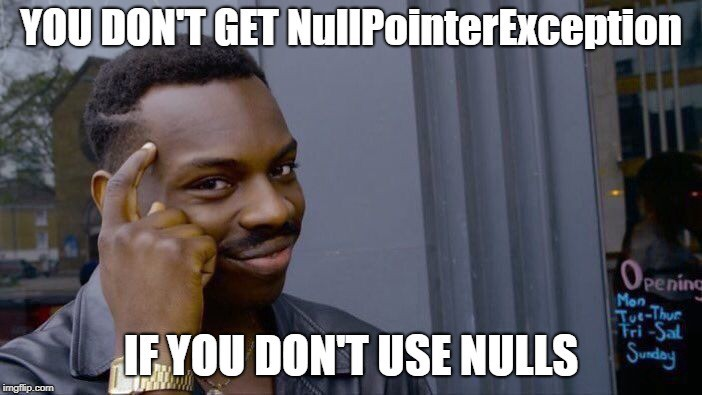

import { me, siteMetadata } from '@/lib/data';
import image from './image.jpg';

export const article = {
  date: '2020-01-15',
  title: 'Dart i walka z nullami',
  description:
    'Pomimo tego, że Dart to stosunkowo nowy język, to wiele mu brakuje do jego konkurencji. Oto jak poradzić sobie z nullami.',
  author: me,
  image,
  lang: 'pl'
};

export const metadata = {
  title: article.title,
  description: article.description,
  author: { name: article.author.name },
  ...siteMetadata,
  keywords: ['flutter', 'dart'],
};

# Dart i walka z nullami

Pomimo swojego młodego wieku i wpływu z innych języków programowania Dart tak naprawdę nie posiada mechanizmu *null safety*, czyli zapobiegania błędom związanym z jego niespodziewanymi wystąpieniami. Dart w swojej standardowej bibliotece nie ma nawet prostego Optionala z Javy, mimo że jest banalny do napisania. Stąd nie dziwią mnie narzekania ludzi przechodzących z Swifta czy Kotlina.

Co prawda kilka dni temu wyszedł Dart w wersji 2.7 a z nim pokazówka nowego systemu typów, który uwzględnia *null safety*. Jest to dosyć drastyczna zmiana, bo zupełnie łamie kompatybilność wsteczną. Oczywiście jest to tylko taka pokazówka dla programistów, więc wszystko może się zmienić, ale sama idea prawdopodobnie pozostanie taka sama. Możesz śledzić postępy [tutaj](https://github.com/dart-lang/language/issues/110), jak i przeczytać o samym [zamyśle](https://github.com/dart-lang/language/blob/master/accepted/future-releases/nnbd/roadmap.md) tej zmiany.

Dziś natomiast chciałbym pokazać jak można wykorzystać inne elementy składni Darta, które mogą nam pomóc rozprawić się z nullami. Będzie też przykład wymienionej pokazówki.

Zanim zaczniemy, kod w wersji angielskiej można sobie odpalić na [tym DartPadzie](https://dartpad.dev/1b123ec2a2923a27ab667ed4f4255e9e).

## Null coalescing operator
*Null coalescing operator* czy też jak dokumentacja Darta to nazywa — *if null operator* to po prostu podwójny znak zapytania `??` który sprawdza nam czy obiekt jest nullem. Jeśli obiekt nie jest nullem to jest on zwrócony, a jeśli jest nullem to drugie wyrażenie jest wykonywane i jego wartość zwracana. 

Jest to mega użyteczne przy ustawianiu domyślnych wartości czy scalaniu dwóch obiektów. Weźmy sobie takie proste Hello World jako przykład:
```dart
void sayHello({ String to }) {
  String secondPart = to ?? "world";
  print("Hello " + secondPart);
}

sayHello(); // -> Hello world
sayHello(to: "Dart"); // -> Hello Dart
```

Tutaj `??` pomaga nam uniknąć `ArgumentError` gdybyśmy przekazali nulla do parametru `to` poprzez dodawanie domyślnej wartości. Ten kodzik możemy jeszcze trochę ulepszyć wprowadzając dodatkowo przypisanie za pomocą `??=`.
```dart
void sayHello({ String to }) {
  to ??= "world";
  print("Hello " + to);
}
```
Choć oczywiście ten przykład jest trochę głupi, bo w tym przypadku można domyślną wartość ustawić na poziomie parametrów.
```dart
void sayHello({ String to = "world" }) {
  print("Hello " + to);
}
```

## Conditional member access
`??` jest przydatne, ale najczęstszym błędem z jakim się spotykamy walcząc z nullami to `NoSuchMethodError`. Dostajemy go, bo próbujemy odnieść się do jakiegoś pola obiektu, którego nie ma, bo obiekt jest akurat nullem. By tego uniknąć możemy wstawić znak zapytania przed kropką — `?.` zanim spróbuje rzeczywiście odnieść się do pola sprawdzi najpierw czy przypadkiem obiekt nie jest nullem i jeśli będzie to przerwie swoją pracę i sam zwróci nulla.

```dart
void mail() {
  RegExp emailDomainRegExp = new RegExp('hello@(.+)');

  // Dzięki naszemu ?. nasz program się nie wysypie na drugim mailu
  String email = "hello@4fun.dev";
  String domain = emailDomainRegExp.matchAsPrefix(email)?.group(1);
  String domain2 = emailDomainRegExp.matchAsPrefix("itwillnotmatch")?.group(1);

  print("domain: $domain, domain2: $domain2");
}
```
W tym przykładzie jeśli nasz email nie przejdzie wyrażenia to nasz program zamiast się wysypać po prostu wyświetli wartość null.

Uwaga: jeśli już raz użyjesz `?.` to praktycznie zawsze będziesz chciał to zrobić w kolejnych odniesieniach. Pamiętaj, że `?.` zwraca nulla, ale nie przerywa operacji za sobą.

```dart
void main() {
  String a;
  
  // Bezpieczne
  print(a?.toLowerCase()?.toUpperCase());
  
  // Wyrzuci NoSuchMethodError
  print(a?.toLowerCase().toUpperCase());
}
```

## Null-aware spread operator
Ostatni trik jest tak unikalny, że prawdopodobnie zostanie jednym z klasycznych pytań rekrutacyjnych Fluttera/Darta. Zasada działania jest prosta — po prostu nie próbuje wypakować się jeśli jest nullem.

```dart
void main() {
  var listA = [1, 2, 3, 4, 5];
  var listB;
  
  print([...listA, ...?listB]); // -> [1, 2, 3, 4, 5]
  
  // Null-aware spread operator nie filtruje nulli!
  var listC = [6, 7, null, 9];
  print([...listA, ...?listC]); // -> [1, 2, 3, 4, 5, 6, 7, null, 9]
}
```



## Null safety
Ten cały lukier składniowy tak naprawdę nie chroni cię przed niespodziewanymi nullami, ale raczej sprawia, że łatwiej je obsługiwać. To się zmieni. 

W skrócie, na podstawie ostatniej pokazówki i dokumentacji: Będzie jak w Kotlinie/Swiftcie czyli aktualne typy np. `int` zostaną typami nie nullowalnymi a `int?` będzie typem nullowalnym, który będzie wymagał sprawdzenia przed użyciem. Taka zmiana będzie wymagała okresu przejściowego, aby projekty mogły spokojnie, **indywidualnie** migrować swój kod.

Przykład tego nowego systemu typów można zobaczyć na tym [specjalnym DartPadzie](https://nullsafety.dartpad.dev/1ede47fde8adf5d4dab09bcf6ddf1ec6).

## Podsumowanie
Dart może nie ma najbezpieczniejszego systemu typów, ale jest wystarczający, w końcu to trochę takie dziecko JavaScriptu i Javy. Mam nadzieję, że triki jakie wam dzisiaj pokazałem oszczędzą kilka linijek klasycznego if null. Celem tego artykułu było sprawienie byście mimo wszystko nie pisali kodu jak w Javie z 2011. Z pozytywów dobrze jest powiedzieć, że Dart ciągle się rozwija i na horyzoncie jest wspaniała przyszłość, przede wszystkim dla tych co przechodzą z Kotlina czy z Swifta.

Wesołego Kodowania 💙


