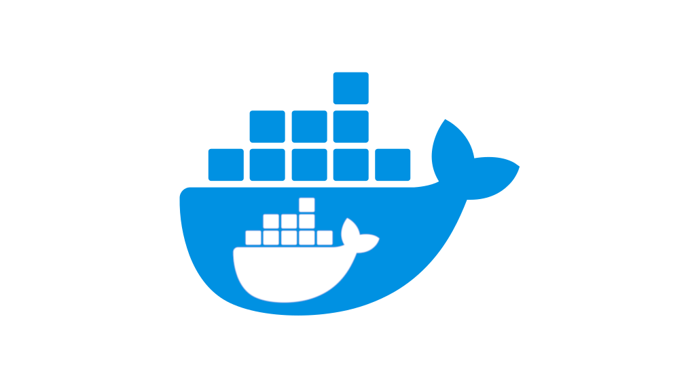

import { me, siteMetadata } from '@/lib/data';
import image from './docker-problem.jpg';

export const article = {
  date: '2019-05-20',
  title: 'Docker w Continuous Integration',
  description:
    'Nawet coś tak relatywnie prostego jak budowanie obrazu Dockera może stać się trudne, jeśli spróbujemy to zoptymalizować.',
  author: me,
  image,
  lang: 'pl'
};

export const metadata = {
  title: article.title,
  description: article.description,
  author: { name: article.author.name },
  ...siteMetadata,
  keywords: ['docker', 'google', 'devops'],
};


# Docker w Continuous Integration
Docker jest jednym z najważniejszych narzędzi do deploymentu nowoczesnych aplikacji. Lekkie, w stosunku do maszyn wirtualnych, kontenery przyniosły nam nowy sposób na odpalanie naszych appek, ale jak to z każdą nowością — pojawiają się też nowe problemy.

## Continuous Integration
Buildy Dockera są łatwe do uruchomienia, ale problematyczne w większej skali. Trochę przypominają klasycznego pipeline'a z takich narzędzi jak CircleCI, Jenkins czy TravisCI, ale znowu nie są na tyle elastyczne, by móc takie narzędzie zastąpić.

Ciekawostką i źródłem problemów, które napotkałem, jest fakt, że Docker buduje obrazy za pomocą kontenerów. Obrazy Dockera są *de facto* klonem kontenera, którego używaliśmy w Dockerfile'u. Zatem, jeśli CircleCI czy Google Cloud Build używa kontenerów do pipeline'ów, to czy możemy uruchomić Dockera w Dockerze?



### Incepcja
Sierpnia 2013 roku kontrybucja Jérôme Petazzoni'ego sprawiła, że jest możliwe uruchomienie Dockera w Dockerze. 2 lata później opublikował on post, żeby tego rozwiązania unikać...

https://jpetazzo.github.io/2015/09/03/do-not-use-docker-in-docker-for-ci/

### Rozwiązanie
Jérôme Petazzoni sugeruje w swoim artykule, aby współdzielić za pomocą wolumenów ten sam kontekst Dockera z uruchomionym kontenerem. Dzięki temu nasz uruchomiony kontener będzie mógł odpalać równoległe kontenery (czyli też buildy) bez dodatkowych problemów z cachowaniem, bezpieczeństwem i złożonością całego procesu.

### A teraz to wszystko w chmurze
*Nie pisałbym tego posta, gdyby sprawa była taka prosta*

W chmurze chcesz mieć kontenery pod swoją kontrolą. Zwykle sprowadza się to do używania jakiegoś programu sterującego np. scheduler z Kubernetesa. Teraz wyobraź sobie, że twój kontener jest w stanie zburzyć tę hierarchię i samemu sobie tworzyć kontenery. Brzmi jak niezły koszmar admina, a co gorsza nie ma prostego rozwiązania tego problemu.

## Docker bez Dockera
*A co jeśli Ci powiem, że możesz nie potrzebować Dockera?*

Jest taki projekt, który nazywa się [kaniko](https://github.com/GoogleContainerTools/kaniko). Googlowski projekt do budowania obrazów Dockera, bez Dockera. Sam projekt obiecuje lepsze cachowanie, kompatybilność i oczywiście brak problemów z Dockera w Dockerze.

Magia, co nie? Nic tylko ściągać i odpalać! Tylko że pewnie byście dostali błąd...


## kaniko — fajny pomysł, ale jeszcze trzeba poczekać.

### Kiedy wielkość ma znaczenie

```txt
FROM node:lts-alpine as Builder
```
Ta linijka działa w Dockerze, ale nie w kaniko.
```txt
FROM node:lts-alpine as builder
```
Ta już działa dobrze. Myślę, że jesteście w stanie wyobrazić sobie moje zażenowanie, kiedy odkryłem takie *cudo*. Issue na GitHubie już był stworzony.

### open /etc/passwd: no such file or directory
Ten problem już mnie przerósł. W skrócie, kaniko nie potrafi wykryć mojego użytkownika. Pomijając fakt, że Docker tak naprawdę nie wymaga tego, żeby taki użytkownik istniał. Pokombinowałem trochę i wyglądało to tak jakby kaniko nie potrafił z własnego cache'u wyciągnąć tej informacji. Szkoda.

https://github.com/GoogleContainerTools/kaniko/issues/477

### Jeszcze nie teraz
Gdy to piszę, na GitHubie jest 104 otwartych i 214 zamkniętych issue'ów. To trochę pokazuje, że to jeszcze nie jest pora, by Google rekomendował to narzędzie w swojej dokumentacji. Jest zbyt wiele problemów do naprawienia.

Co do samej idei — są alternatywy. Jedna z najlepszych to [img](https://github.com/genuinetools/img). Jako tako dał radę zbudować mój obraz, ale najpierw musiałem pobrać repo, __zbudować img i odpalić budowanie w Dockerze__. To nie jest najlepszy UX.

Na koniec, czy to ma jakiekolwiek znaczenie? Większość firm i tak używa gotowych rozwiązań i kilka dodatkowych minut na budowanie obrazu nie robi jakiś wielkich różnic, natomiast jeśli potrzebujesz swojego rozwiązania może warto rozważyć użycie starych, dobrych wirtualek. Ja tymczasem wracam do Cloud Builda, mimo, że [nie jest perfekcyjny](https://stackoverflow.com/questions/50249644/how-to-cache-multi-stage-docker-build-in-google-cloud-builder).