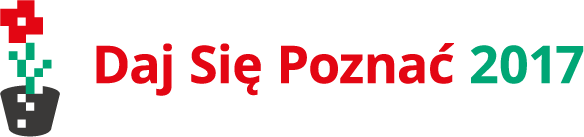

import { me, siteMetadata } from '@/lib/data';
import image from './dsp2017.jpg';

export const article = {
  date: '2017-05-31',
  title: 'Daj Się Poznać',
  description:
    'As you use async/await in your Express handlers you might have noticed that errors are not handled properly. Let’s fix that.',
  author: me,
  image,
  lang: 'pl'
};

export const metadata = {
  title: article.title,
  description: article.description,
  author: { name: article.author.name },
  ...siteMetadata,
  keywords: ['express', 'nodejs', 'javascript', 'typescript'],
};

# Daj Się Poznać

Oto podsumowanie mojego udziału w konkursie Daj Się Poznać 2017.

### Cel
Nie stać w miejscu i robić coś ciekawego — to był mój cel. Zawsze kiedy pracowałem przy jakimś projekcie mając go w myślach jako osobiste wyzwanie to czułem, że naprawdę czegoś się uczę. Tak było z moimi aplikacjami Android, Javy, Google Code-In, podróży na konferencje i teraz — blogowaniem.

### Spring
Java to jeden z najpopularniejszych języków programowania. Nie dziwię się, dziwię się natomiast dlaczego Spring jest standardem w klasie Enterprise. Może to wina kompatybilności z poprzednimi wersjami a może po prostu nie mam dostatecznej wiedzy aby to zrozumieć. Nie ważne, ważne, że chciałem podszkolić się w jego znajomości i mieć taki przykład gdzie wykorzystałem Spring Security, OAuth etc. Trochę się nie udało, bo po pierwsze Spring bardzo spowolnił development Workdone'a a po drugie wywaliłem go do osobnego projektu, bo nie spełnił moich wymagań. Zdarza się.

### JavaScript i Vue.js
Mój projekt konkursowy zmusił mnie do bliższego spotkania z rozbudowanym JavaScriptem. Wcześniej pisałem tylko króciutkie skrypty a coś większego to była aplikacja w Angularze 1. Tym razem zapoznałem się z nowym podejściem, zupełnie innym od tego wcześniej. Moduły, ES2015, npm — to było coś czego nie znałem. Nie była to łatwa droga, nawet dla mnie, a ja uwielbiam poznawać nowe technologie. Cieszę się, że najgorsze już za mną.

Bardzo przydatnym w tej przygodzie był Vue.js. Znakomity framework z solidną dokumentacją. Mam wrażenie, że przez sposób w jaki kodzimy w Vue możemy odnieść wrażenie, że nie narusza on podstawowej struktury strony, ta cecha pomaga przy tej zmianie myślenia starego JSa na nowego. Mam przeczucie, że Vue.js zagości na dłużej w moim arsenale.

### Filmy
Podczas konkursu zrealizowałem jeden film, który zresztą miał być tylko filmem objaśniającym cechy języków np. język statyczny a dynamiczny. Później były matury i już nie miałem ochoty na kręcenie. Myślę, że w tym aspekcie wpadłem w pułapkę perfekcjonizmu. Starałem się aby moje filmy były idealne, a wyszło tak, że nie zrobiłem drugiego. Wniosek? Jak tylko odzyskam aparat to zacznę kręcić filmy, bo teraz mam dużo wolnego czasu a szczerze — pisanie to nie moja działka.

### Czasem nie było tak kolorowo
No właśnie, pisanie. Na początku była to dla mnie najgorsza część konkursu. Nie lubię lekcji języka polskiego, literatury i to pisanie sprawiało mi kłopot. Teraz też nie powiedziałbym, że jestem pisarzem czy przynajmniej blogerem. Pisanie niektórych postów to była dla mnie przyjemność, tak było np. z postem [Moja pierwsza konferencja](/post/moja-pierwsza-konferencja/) czy z [Google Code-In](/post/google-code-in/).

Nie oszukuję, część postów była pisana byleby tylko coś było, ale czy to źle? Może to właśnie to wymaganie miało ustrzec przed popadaniem w wspomniane piekło perfekcjonisty czy prozaiczne lenistwo. Zawsze warto ćwiczyć i tworzenie tych niechcianych tekstów może właśnie takim ćwiczeniem były.

### Efekt (końcowy)
Zobaczcie sami na [workdone.xyz](https://workdone.xyz). Nie, projekt nie jest skończony i brakuje w nim wiele rzeczy. Prace trwają.

### Co dalej?
Blog pewnie już nie będzie aktualizowany tak często, pojawią się za to filmy i o wiele lepsze posty o bardziej sprecyzowanej tematyce. W planach mam też zainteresowanie się językiem Go lub ewentualnie Pythonem, ale dlaczego nimi to już kiedy indziej.
