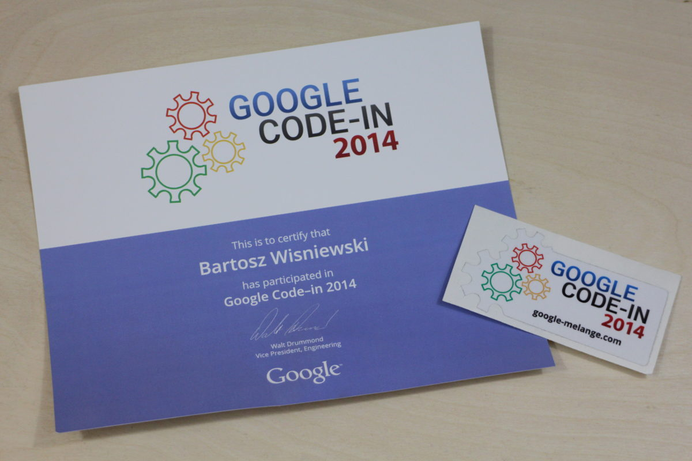
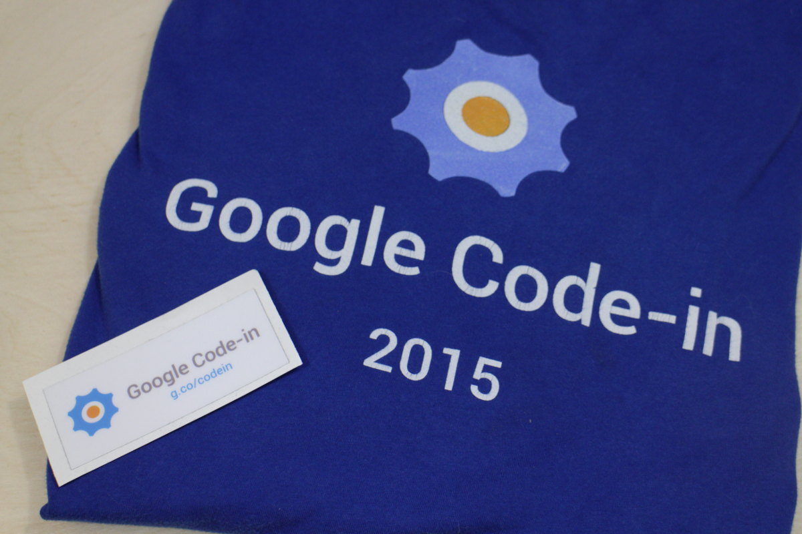

import { me, siteMetadata } from '@/lib/data';
import image from './gci.jpg';

export const article = {
  date: '2017-03-26',
  title: 'Google Code-In',
  description:
    'Google Code-In to coroczny międzynarodowy konkurs dla osób w wieku 13-17 lat mający za zadanie zachęcić do programowania i świata open-source.',
  author: me,
  image,
  lang: 'pl'
};

export const metadata = {
  title: article.title,
  description: article.description,
  author: { name: article.author.name },
  ...siteMetadata,
  keywords: ['konkurs', 'google'],
};

# Google Code-In

Google Code-In to coroczny międzynarodowy konkurs dla osób w wieku 13-17 lat mający za zadanie zachęcić do programowania i świata open-source. Uczniowie wybierają sobie zadania, które są tworzone przez [współpracujące organizacje](https://codein.withgoogle.com/organizations/), realizują je i poddają ocenie.
Na końcu organizacje wybierają swoich finalistów i zwycięzców, którzy otrzymają główną nagrodę — wycieczkę do kampusu Google.

## Moja historia
## 2014
Moją pierwszą stycznością z GCI była edycja z 2014 roku. Zarejestrowałem się, zrobiłem jedno zadanie i odpuściłem sobie. Z tego co pamiętam to przytłoczyła mnie (pozorna, jak się później okazało) trudność tych zadań a na dodatek brak pewności siebie i jakiegoś wsparcia.

*Oto co otrzymałem po Google Code-In 2014, dalej nie wiem gdzie mam sobie to nakleić*

## 2015
### Postanowienie
Rok 2015 był dla mnie rokiem rozwojowym jeśli chodzi o programowanie i postanowiłem w edycji 2015 naprawdę się postarać, szczególnie, że była to moja ostatnia szanse na wzięcie udziału. Wybrałem sobie organizacje FOSSASIA, głównie ze względu na różnorodność zadań. Zadań zrobiłem dużo, bo aż 41 i gdyby spojrzeć na listę uczestników i ilość zadań wykonanych to byłbym na 8 miejscu, wszystko to bez pomocy, przy starcie opóźnionym o 10 dni, głównie ze względu na szkołę...

### Zadania
Były one różnorodne.

Często celem było napisanie statycznej strony z jakimś skryptem w JS np. [Game: Hangman Game in Javascript](https://codein.withgoogle.com/archive/2015/task/5226804742717440/) — [GitHub](https://pr0gramista.pl/HangmanGame)). Ciekawsze były te gdzie trzeba było zrobić aplikacje
np. w Javie [Game/FOSSASIA quiz: Create a multi-choice quiz/game in JAVA with UI](https://codein.withgoogle.com/archive/2015/task/5655424225247232/) — [GitHub](https://github.com/PoprostuRonin/FOSSQuiz)
czy apka Androidowa [Android: Capture and store an Image in an android app](https://codein.withgoogle.com/archive/2015/task/6264450050949120/) — [GitHub](https://github.com/PoprostuRonin/CameraApp). GCI również poznało mnie z Pythonem (z frameworkiem Kivy) i językiem Go. Takim unikatowym doświadczeniem były zadania przy [loklak'u](http://loklak.org/) gdzie zajmowałem się stawianiem instancji na różnych serwisach, również przy wykorzystaniu Dockera i tworzeniem poradników.

Tylko jedno zadanie porzuciłem a dotyczyło ono aplikacji na Androida. Moim celem było napisanie testów UI. Ich napisanie było całkiem łatwe, ale Travis CI nie dawał rady ich przeprowadzić (?), chyba uznawał, że aplikacja się zacięła i przerywał testy. Pewnie wystarczyłaby jedna linijka w konfiguracji i byłoby po problemie, ale CI było wtedy dla mnie jeszcze nie znane. Szkoda, że nikt mi wtedy nie pomógł.

<iframe className="w-full" src="https://files.pr0gramista.now.sh/gcimail.html" height="500"></iframe>
Mail podsumowujący mój udział

### Wygrana?
Nie zostałem nawet finalistą, choć pod względem ilości powinienem, ale pamiętajmy, że ilość nie jest czynnikiem decydującym.
Zapewne gdyby finalistów miało być sześciu to ja byłbym tym szóstym. Byłem trochę zawiedziony wynikami. W końcu przez ponad miesiąc kodziłem w zastraszającym tempie i to co mnie często powstrzymywało to różnica pomiędzy wysłaniem rozwiązania a jego sprawdzeniem. Zgaduje, że trwało to u mnie dłużej niż u innych, głównie ze względu na różnice czasu, choć czekanie przez 2 dni było trochę deprymujące. Nierzadko zdarzała się sytuacja, gdzie robiłem zadania na zapas i czasem one zdążyły zniknąć zanim je wysłałem.

### Co zyskałem?
Mase wiedzy i obeznania w technologii. Przyzwyczaiłem się do korzystania z gita, pisania po angielsku i szukania informacji, czyli pracy z dokumentacją (czasem języka, czasem serwisu takiego jak IBM Bluemix) i kochanym Stack Overflow. Ten konkurs to była też okazja do wyjścia z jaskini i sprawdzenie swoich umiejętności.

No i nagrody rzeczowe:

## EOF
Jeśli macie mniej niż 18 lat to spróbujcie swoich sił w Google Code-In, bo naprawdę warto. Moja rada: wybierzcie organizacje z którą współpracuje mniej ludzi. FOSSASIA to gigant jeśli chodzi o GCI i można się na tym przejechać. Pamiętajcie aby pytać, jeśli czegoś nie wiecie, ja osobiście chętnie pomogę wam.

Kiedyś napisałem skrypt (o ironio w Pythonie) aby policzyć ilość zadań jaką wykonali poszczególni uczestnicy. Strona z tabelą dostępna tutaj: [Google Code-In 2015 Unofficial leaderboard](http://poprosturonin.com/gci/).

