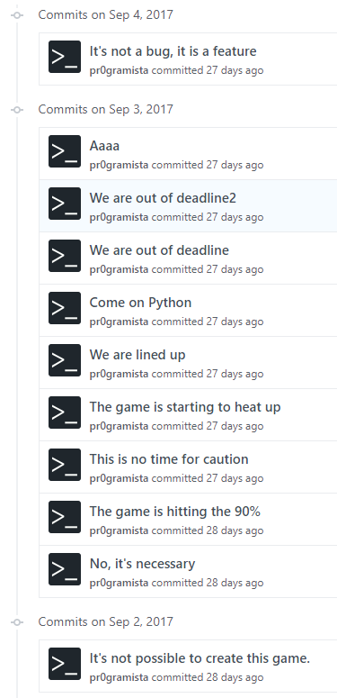

import { me, siteMetadata } from '@/lib/data';
import image from './its_super_cool.jpg';

export const article = {
  date: '2017-10-05',
  title: "It's Super Cool",
  description:
    'Uwielbiam gamedev, ale ciężko jest stworzyć grę bez bandy grafików, dźwiękowców i designerów.',
  author: me,
  image,
  lang: 'pl'
};

export const metadata = {
  title: article.title,
  description: article.description,
  author: { name: article.author.name },
  ...siteMetadata,
  keywords: ['gamedev', 'konkurs', 'python'],
};

# It's Super Cool

Uwielbiam gamedev, ale ciężko jest stworzyć grę bez bandy grafików, dźwiękowców i designerów.
Oczywiście są pewne wyjątki gdzie programista może być takim "one man army" dla przykładu — Minecraft.
Problem można też rozwiązać wykorzystując gotowe zestawy assetsów, ale ich jest mało i zwykle są bardzo ograniczone.

Na początku sierpnia Gynvael Coldwind ogłosił konkurs
[Gynvael's Summer GameDev Challenge 2017](http://gynvael.coldwind.pl/?id=657) w którym
celem było stworzenie jak najlepszej gry wykorzystując tylko grafiki z załączonej
paczki stworzonej przez [Kenney'ego](https://kenney.nl/assets/space-kit). Gatunek gry, udźwiękowienie, język programowania dowolny. 
Podział na dwie kategorie: gry stworzone od prostej biblioteki np. PyGame, SDL (wykluczony libGDX) 
i na gry stworzone na podstawie silnika np. Unity. Czas na stworzenie gry: miesiąc.

*Space Kit, którego trzeba było użyć*

### It's Super Cool

Na początku nie byłem pewny czy wziąć udział w tym konkursie. Byłem zajęty a brakowało mi pomysłu. Nie łatwo
jest stworzyć oryginalną grę na takich zasobach. Z drugiej strony brakowało mi casualowej gry do zagrania ze
znajomymi. Pewnego dnia zacząłem eksperymentować z assetsami i przyszedł mi do głowy
genialny pomysł — Kosmiczny Quidditch. Gra miała być wieloosobowa (z opcją grania na tym samym komputerze), 
łatwo rozszerzalna (znajomi to programiści) i zdolna do odpalania na wszystkim.

Jeśli chodzi o grafiki to wszystko mi się ułożyło: piłka z asteroidy, 
bramki z wsporników do rur, widownia z schodów i dwie drużyny: astronauci i kosmici. Nawet nazwę szybko
wymyśliłem inspirując się ostatnimi odcinkami South Parku (S20E06)

> Zrobię od zera, pewnie mniej ludzi tak zrobi...

### Lenistwo

Zanim mogłem zacząć kodzić to najpierw musiałem stworzyć podstawową mapę. Na początku myślałem, że napiszę
własny format mapy i jej wczytywanie, później spróbowałem wykorzystać [Tiled Map Editor](http://www.mapeditor.org/),
ale nie moje elementy okazały się zbyt losowo rozmieszczone, zatem ostatni sposób — GIMP i do przodu.
Szybkie skalowanie, warstwy i mnóstwo duplikowania. Szło mi to powoli i już po kilku godzinach nie miałem
sił do tego wracać, ale w końcu skończyłem mapę i przeszedłem do kodzenia.

### PyGame

Wolałbym użyć znanego mi libGDXa, ale on dostał bana w kategorii "od zera". Pomyślałem, że skoro się uczę
Pythona to jego dodatek w formie gamedeva mi nie zaszkodzi. Początki były całkiem łatwe, problem pojawił się
tworzeniu serwera gry. Po prostu było za mało czasu na przymyślenie każdego ciągu wydarzeń na serwerze. Nie potrzebnie
bawiłem się w własny socket — było użyć HTTP i lepiej dbać o spójność danych. Muszę powiedzieć, że: sporo się nauczyłem w te **4 dni**.

To nie żart, w 4 dni zdążyłem nauczyć się korzystać z PyGame, napisać grę i ją przetestować. Jakość kodu,
synchronizacji i optymalizacji może nie jest najlepsza, ale jak na coś pisanego bez planu i czasu daję 5.

### Not cool

Wysłałem maila z zgłoszeniem, dodatkowo jak Gynvael prosił to napisałem komentarz pod postem. Czekałem na wyniki, ale zanim
zostały ogłoszone pojawił się filmik z prezentacją gier. Nerwowo skaczałem po pasku YouTuba i nie mogłem
znaleźć gry. O nie, czyżby coś się zepsuło? 

Napisałem maila i sprawa szybko się wyjaśniła a Gynvael nawet stworzył dodatkowe wideo z moją grą.

<iframe width="560" height="315" src="https://www.youtube.com/embed/CB62TQ13fC4" frameborder="0" allowfullscreen></iframe>

### Not cool2

To była środa, okropny dzień (rozsypała się partycja na biurowym komputerze...) i pojawiły się [wyniki](http://gynvael.coldwind.pl/?id=663). tldr: 
Z jednej strony pozytywnie, ale oczywiście nic nie wygrałem. 

> Fajnie jest brać udział w konkursach, gorzej jeśli się w nich przegrywa

### Było zrobić na Unity?
Jeśli myślimy kategorią nagrody to rzeczywiście użycie Unity ze względu na brak konkurencji byłoby optymalne. Zrobienie gry nie zajęłoby mi 4 dni a może jeden wieczór.
Multiplayer, edytor sceny i sterowanie do padów miałbym z głowy, ale za to — brak wyzwania. Niczego nowego bym się nie nauczył. 

### Wina serwera?
Serwer mojej gry nie jest najstabilniejszy, ale przy współpracy uczestników (najlepiej jakby każdy nic nie robił) 
dało się zagrać w 4 osoby. Sądzę, że największy błąd jaki zrobiłem to odpalenie gry dopiero po połączeniu się. Klient
dostaje pakiety (których nie buforuje), ale przez te kilka milisekund gra jeszcze nie jest gotowa i dzieją się różne dziwadła.

### Przyszłość

Do "It's Super Cool" jeszcze wrócę, bo w połączeniu z Raspberry Pi może to być genialna zabawa na imprezie. 
Plus w końcu do czegoś wykorzystam moją malinkę, a co do konkursów — w najbliższym czasie postaram się ich unikać, głupie są.

**Fun fact:** duża część efektów dźwiękowych to odgłosy wydawane przez znajomego na TeamSpeaku.

*Efekt końcowy*
