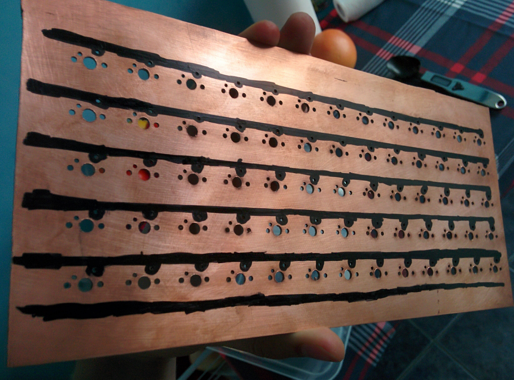

import { me, siteMetadata } from '@/lib/data';
import image from './hello.jpg';

export const article = {
  date: '2017-12-10',
  title: 'Klawiatura - prototyp',
  description:
    'Prototyp własnoręcznie zbudowanej klawiatury mechanicznej i lekcje z tego projektu.',
  author: me,
  image,
  lang: 'pl'
};

export const metadata = {
  title: article.title,
  description: article.description,
  author: { name: article.author.name },
  ...siteMetadata,
  keywords: ['arduino', 'majsterkowanie'],
};

# Klawiatura - prototyp

Klawiatura to najważniejsze narzędzie programisty. Mimo tylu lat i rozwoju technologii klawiatury dużo się nie zmieniły. Może są cieńsze i tańsze, ale ich funkcje, ilość i ustawienie przycisków się praktycznie nie zmieniło. Pora to zmienić!

### Hello world

To co widzicie powyżej to moja własnoręcznie zbudowana klawiaturę mechaniczna. 61 klawiszy z przełącznikami Gateron Brown, 100% anti-ghosting, dużooo miejsca na makro i dodatkowo enkoder i potencjometr. Sercem klawiatury jest mikrokontroler Teensy LC, który jest kompatybilny z Arduino. Klawiatura jest normalnie wykrywana jako urządzenie wejściowe, żadnych sztuczek. Cały soft napisałem sam, choć nie jest to rocket science.

### Dlaczego?

Powodów jest kilka:

* Droga do perfekcji — sięganie po strzałki, klawisze home/end, nieużywanie klawiszy pod prawym shiftem, zupełny brak kontroli nad klawiszami funkcyjnymi skłoniły mnie znalezienia drogi do lepszej pracy.
* Makro — nienawidzę skomplikowanych skrótów klawiszowych i dużo bym zyskał mając około 180 miejsc na makra.
* Cena — nie wierzę, że dobre klawiatury mechaniczne muszą kosztować ponad 400 zł. Jako przedstawiciel klasy średniej postanowiłem wykonać kalkulacje, oszacować koszty i stwierdziłem, że ja mogę to zrobić taniej. Nie myliłem się, choć rozłożenie kosztów może zdziwić.
* Nieśmiertelność — moja klawiatura w moich rękach jest nieśmiertelna. Mogę ją zalać, podpalić i przejechać czołgiem, ale zawsze będę ją w stanie naprawić.
* Bycie fajnym — na Massdropie ludzie wydają grube pliki dolarów aby otrzymać produkt podobny do mojego a ja zbudowałem to sam. Znacie kogoś innego kto pisze bloga na własnoręcznie wykonanej klawiaturze?

### Jak?

### Ale najpierw prototyp (maj 2017)

Klawiatura, którą już widzieliście to nie jest moja pierwsza klawiatura. Przed nią wykonałem prototyp. Nie planowałem go, ale w ręce wpadło mi trochę darmowych materiałów i postanowiłem przetestować swoją wizję. Wykonanie prototypu pozwoliło mi uniknąć kilku błędów przy tworzeniu mojej wymarzonej klawiatury z których wcześniej zupełnie nie zdawałem sobie sprawy. W tym poście opowiem o tych problemach.

#### Galeria

Najpierw zdjęcia abyście nie czuli się zupełnie zagubieni podczas dalszej lektury. Na zdjęciach widać kilka ciekawych rozwiązań np. mocowanie na wiertła, ścieżki z markera czy też druciki łączące dwie strony płytki.

#### Keycapsy i przełączniki
 
Do prototypu użyłem przełączników i nakładek po starych kasach fiskalnych. Okazuje się, że skrywają one przełączniki MX Cherry Black, niezbyt przydatne dla większości użytkowników przez duży nacisk wymagany do aktywacji i liniowość ruchu. Idealne pole testowe.

#### PCB or plate mount

Są głównie dwa sposoby montowania przełączników. Jeden opiera się na wykorzystaniu płytki PCB i wlutowania w niej przycisków stosując przy tym dodatkowe stabilizatory. Drugi sposób to wciskanie przycisków w odpowiednie wyżłobienia w płytce wykonanej np. z aluminium. Do zbudowania prototypu postanowiłem skorzystać z tej pierwszej opcji, bo jest ona łatwiejsza do wykonania samemu, ale efekty mogą nie być satysfakcjonujące. Niska precyzja wywierconych dziur sprawiła, że przyciski są dosyć krzywe a sama płytka po wytrawianiu stała się bardzo elastyczna. Wniosek na przyszłość: użyć innego mocowania albo zdobyć profesjonalnie wykonaną płytkę.

#### Kabelki czy nie kabelki

Masz przed sobą 65 klawiszy. Jak je połączysz? W przypadku płytki PCB to dosyć proste, choć tutaj pojawia się problem dalszego połączenie z kontrolerem, które w prototypie jest bardzo niestabilne. Użyłem kabelków stworzonych z myślą o płytkach prototypowych. Duży błąd, ale później znalazłem świetny zamiennik — kabelki z typowej skrętki RJ-45. Tanie, łatwe w lutowaniu i stosunkowo wytrzymałe.

#### Anti-ghosting

Widzicie takie druciki z wybrzuszeniem? To są diody, które powodują, że prąd może płynąć tylko w jedną stronę. W prototypie zlutowałem je w złą stronę (musiałem odwrócić skanowanie), wynikało to z braku wiedzy o INPUT_PULLUP. Umieszczenie ich pozwala na pozbycie się ghostingu, który w uproszczeniu ogranicza liczbę wykrywanych jednocześnie przycisków. Typowe klawiatury nie pozwalają na wciśnięcie więcej niż około sześciu klawiszy. Zwykle nie sprawia to większych problemów, ale gdy spróbujesz zagrać z przyjacielem na jednej klawiaturze to bardzo mocno to odczujecie.

> At the extreme, keyboards have been made with a diode at every key so that each key can be detected individually ~[Microsoft Applied Sciences Group: Keyboard Ghosting Explained!](https://www.microsoft.com/appliedsciences/antighostingexplained.mspx)

#### Layout i software

Od początku wiedziałem, że layout w mojej klawiaturze nie może być zupełnie nowy, strzeliłbym sobie w stopę porzucając QWERTY. Zastanowiłem się co jest mi potrzebne i jak mogę to polepszyć. Dodatkowa, dolna warstwa była kluczem do osiągnięcia celu. Wystarczy zdefiniować klawisz warstwy dolnej, który działa podobnie jak Shift, później zamiast wciskać F1 będę wciskać [warstwa dół] + 1. Skonfigurowanie tych wszystkich opcji trochę trwa, ale wynik to bardzo naturalny sposób na powiększenie możliwości klawiatury bez dodawania klawiszy. Oczywiście w przypadku prototypu równe wiersze i kolumny (ortholinear) zaburzają rzeczywisty layout (US), ale idea jest ta sama — pozbyć się długich ruchów nadgarstków.

### EOF

Jeśli tutaj dotarłeś to bardzo proszę pochwal się tym w komentarzu. Twoja reakcja na ten projekt bardzo mnie ciekawi.

Prototyp nie był zbyt używalny. Połączenia były zbyt zawodne, klawisze nie satysfakcjonujące i całość zbyt uginająca się, ale niczego nie żałuję — to była świetna zabawa! W następnym poście opowiem o procesie tworzenia już ostatecznej klawiatury, który nie był już taki barwny jak prototypu, i o implementacji dodatkowych funkcji. Wspomnę też o planach związanych z tym projektem.

[Repozytorium kodu klawiatury](https://github.com/pr0gramista/hello_world_keyboard)

