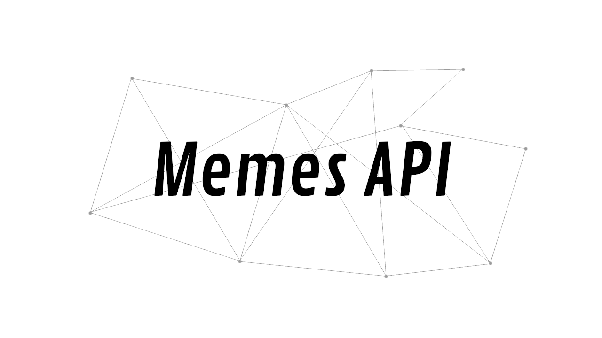

import { me, siteMetadata } from '@/lib/data';
import image from './image.jpg';

export const article = {
  date: '2019-06-03',
  title: 'Memes API v2',
  description:
    'Jak pięciokrotnie zmniejszyć ilość kodu? Jak można było zaoszczędzić? Oto druga wersja mojego najdłużej żyjącego projektu.',
  author: me,
  image,
  lang: 'pl'
};

export const metadata = {
  title: article.title,
  description: article.description,
  author: { name: article.author.name },
  ...siteMetadata,
  keywords: ['zeit', 'memes', 'python', 'google'],
};

# Memes API v2

Kiedy zacząłem pracę nad Memes API, nie wiedziałem, że będę ten projekt rozwijał tak długo — to już prawie 3 lata! Przez ten czas wiele się nauczyłem a projekt się zestarzał. 

Co jakiś czas upgradowałem paczki i możliwości deploymentu. Podbiłem wersje Spring Boota, zmigrowałem z Javy 8 do 11, stworzyłem i poprawiałem obraz Dockera, ale to wciąż nie było to. Mimo tego, że kod działa postanowiłem stworzyć wersje 2.



## Błędy przeszłości
### Język i framework
Pierwszym problemem trapiącym wersje 1 był wybór języka i frameworku. 3 lata nie obchodziło mnie czy Java i Spring ma sens — po prostu chciałem się ich nauczyć.

Okazało się, że nie był to najlepszy wybór. Java sprawiła wiele problemów z typowaniem, które nie przynosiło żadnych większych korzyści. Konfiguracja Springa jest przesadnie skomplikowana do takiej prostej aplikacji. Spring również nie nadawał się do serverlessa, co pozwoliłoby pozbyć się kosztów serwera.

### Testowanie
Kolejnym strzałem w kolano było to, jak testowałem parsery stron. Każda strona miała swoje testy, które polegały na ręcznym sprawdzeniu, czy dane się zgadzają. Podejście proste, ale totalnie nieefektywne w tej skali.

Testy integracyjne często padały, mimo że serwis działał. Wynikało to ze stałych adresów stron, które testy sprawdzały, a strony mogły po prostu blokować.

## Pora na zmiany
Wiadomo, że trzeba było coś zmienić, ale jak to zrobić, żeby się znowu nie wkopać? Trzeba wrócić do programistycznego laboratorium i przeprowadzić swoje badania.


### Kotlin
Kotlin jest modny i pracuje na JVM, zatem mógłbym dosłownie skonwertować część aktualnego kodu i tylko poprawić kilka części. Tak niestety tylko było w teorii, bo w praktyce okazało się, że null-safety w Kotlinie zupełnie nie pasuje do parsowania stron. Po prostu bardziej się opłaca łapać wyjątki!

Kotlin oferuje też wiele ciekawych frameworków. Ktor po pierwszych testach pokazał, że potrafi w prosty sposób zastąpić Springa. Mimo to, z moim doświadczeniem z NodeJS, wolałem pójść w coś jeszcze bardziej ogołoconego z funkcji.


### JavaScript
Naturalnym krokiem było przetestowanie tego jak NodeJS, dałby sobie radę w tym zadaniu. Pod względem serwerowym wypadł świetnie, ale z parsowaniem nie byłem tak przekonany. Są dostępne biblioteki takie jak Cheerio, JSDom czy nawet puppeteer, ale wszystkie nie były stworzone stricte pod scraping. Tutaj doszedł argument, że NodeJS jako tako źle sobie radzi z multithreadingem. NodeJS odpadł, bo jest jeszcze jedna opcja.


### Python
Python jest jednym z moich ulubionych języków. Rozsądna społeczność, dojrzałe narzędzia i ciekawie zrównoważony język, dynamiczny, ale z silnym typowaniem. Biblioteki do scrapowania są świetnie rozwinięte — BeautifulSoup i scrapy. Python ma też podobną siłę do NodeJS, jeśli chodzi o serverlessa i możliwości deploymentu.

Wybór został dokonany :)

## V2
Przepisanie całego Memes API trwało około tygodnia, całkiem niewiele jak na pet project. Cały proces przebiegał naprawdę sprawnie a fakt, że widziałem dużą poprawę kodu, motywował do dalszego pisania.

Ostatecznie do operacji na HTMLu użyłem biblioteki [parsel](https://github.com/scrapy/parsel), to ją pod spodem wykorzystuje scrapy. Nie jest ona perfekcyjna, ale jest szybka (wykorzystuje lxml) a po przyzwyczajeniu się do pewnych mechanizmów pisanie selektorów idzie gładko.

### Serverless
Utrzymanie Memes API to niby jakieś grosze, ale gdy wezmę pod uwagę, że hostuję tę apkę już od 3 lat, sprawa wygląda trochę inaczej. Ciężko mi oszacować koszt samego Memes API, bo dopiero ostatnie kilka miesięcy siedziała sobie na osobnej maszynie, ale koszt przekroczyłby 200zł. Plus, jak się też okazuje — trzeba się też taką maszyną opiekować.

Oczywistym rozwiązaniem jest serverless, ale Spring ze swoim czasem startowania zupełnie się go tego nie nadaje. Myślałem, żeby tylko wymienić Springa na np. Play czy Micronauta, ale nigdy nie miałem na to chęci, szczególnie że nie naprawiłoby to prawdziwego raka tego projektu.

Już od momentu, gdy po raz pierwszy odpaliłem v2 z obsługą HTTP (Flask), chciałem wszystko zdeployować. Akurat ostatnio bawiłem się usługą ZEIT Now i postanowiłem przetestować ich możliwości z Pythonem. Całość jest bardzo prosta do ustawienia i zajmuje dosłownie 2 linijki.

```json
// now.json
{
  "version": 2,
  "name": "memes-api",
  "builds": [
    { "src": "main.py", "use": "@now/python", "config": { "maxLambdaSize": "15mb" } }
  ],
  "routes": [
    // Powoduje, że to Flask obsługuje routing a nie ZEIT Now
    { "src": "/.*", "dest": "/main.py"}
  ]
}
```

Póżniej wystarczyło tylko pushować do GitHuba z podłączonym pluginem od ZEITa, lub po prostu deploywać ze swojego kompa z CLI `now`.

Dodatkowo postanowiłem sprawdzić, jak Google App Engine by sobie poradził z moją apką. Konfiguracja sprowadziła się do 1 linijki *runtime: python37* i zmiany skryptu głównego z *app.py* na *main.py*. Deploy za pomocą komendy 'gcloud app deploy --project=memes-stuff'

### Testy
W wersji 1 testy sprawiały mi wiele kłopotu. Czasem rzeczywiście pomagały i np. informowały o zmianach układu na stronie, ale w większości przypadków powodowały one tylko frustracje, związane z koniecznością edytowania ręcznie pisanych porównań na danych.

W wersji drugiej postawiłem na bardziej pragmatyczne podejście do tematu. Do parserów użyłem snapshotów, bo są szybkie do stworzenia, a ich celem jest po prostu sprawdzenie czy parser dalej dobrze parsuje po jakiś zmianach. Drugą formą testów są integracyjne, pobranie akualnej strony i jednej w tył i sprawdzenie, czy są jakieś memy. Testujemy Flaska i czy strona jako tako działa. Ostatnie testy to unity na utilsach, żeby nie było niespodzianek. To wszystko w **3 plikach**.

#### PyTest okazał się bardzo przyjemnym narzędziem.
Tutaj używam monkeypatcha, aby zmockować na poziomie importów funkcje do pobieranie dokumentów, aby otrzymywała tylko dane z plików lokalnych.
```python
# tests/test_parsers.py
def test_demotywatory_parse(files, snapshot, monkeypatch):
    def fake_download(url):
        f = "demot-{}.html".format(utils.get_last_part_url(url))
        if f in files:
            return files[f]
        raise Exception()

    monkeypatch.setattr("parsers.demoty.download", fake_download)

    snapshot.assert_match(jsons.dumps(demoty.parse(files["demotywatory.html"])))
```
Ciekawostką było to, że w Pythonie importowanie za pomocą *from X import Y* sprawia, że mockować trzeba nie ten importowany moduł, ale już zaimportowany w docelowym pliku. Normalnie do *setattr* przekazalibyśmy "utils.download", ale nie w tym przypadku.

Innym featurem PyTest jest możliwość parametryzowania testow w taki prosty sposób:
```python
# tests/test_flask.py
sites = [
    "/kwejk",
    "/jbzd",
    "/9gag",
    "/9gagnsfw",
    "/demotywatory",
    "/mistrzowie",
    "/anonimowe",
]


# This test could fail if the site changes it's schema or is not functional
@pytest.mark.parametrize("site", sites)
def test_sites(client, site):
    r = client.get(site)

    assert r.status == "200 OK"
    data = json.loads(r.data)

    assert len(data["memes"]) > 0
    assert data["next_page_url"] is not None

    r = client.get(data["next_page_url"])

    assert r.status == "200 OK"
    data = json.loads(r.data)

    assert len(data["memes"]) > 0
    assert data["next_page_url"] is not None
```

W taki właśnie sposób udało się uzyskąc pokrycie kodu na około 90%.

## EOF
Udało się zejść z 3300 linijek do około 600. 5 razy mniej kodu przy porównywalnych możliwościach, bo niestety, ale parserów do pojedynczych stron jeszcze nie ma.

Koszt utrzymanie zmniejszył się praktycznie do zera. Appka jest przetestowana. Kod jest znacznie czytelniejszy i otwarty na modyfikacje, a ich jest jeszcze kilka do zrobienia.

To był pracowity i przyjemny tydzień!