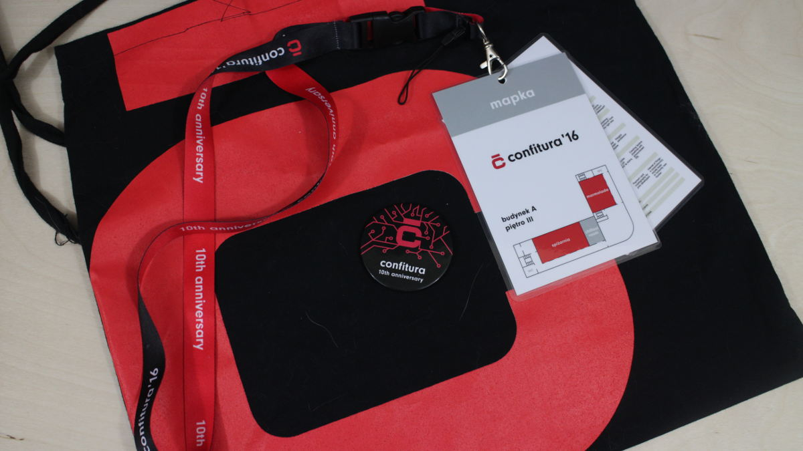
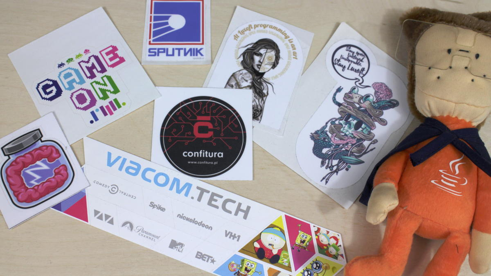

import { me, siteMetadata } from '@/lib/data';
import image from './confitura-2016-press.jpg';

export const article = {
  date: '2017-03-16',
  title: 'Moja pierwsza konferencja',
  description:
    'Relacja z confitura 2016 i wrażenia z pierwszej konferencji programistycznej.',
  author: me,
  image,
  lang: 'pl'
};

export const metadata = {
  title: article.title,
  description: article.description,
  author: { name: article.author.name },
  ...siteMetadata,
  keywords: ['konferencja', 'podroz'],
};

# Moja pierwsza konferencja

Czytając [Inżynierskie Targi Pracy w oczach studenciaka](http://codingtime.pl/2017/03/16/inzynierskie-targi-pracy-w-oczach-studenciaka/)
przypomniała mi się moja przygoda związana z moim pierwszym zetknięciem się
z konferencją, a była to confitura 2016 na którą
pojechałem z ciekawości i chęci podszkolenia się z Javy.

[confitura](confitura.pl) to coroczna polska konferencja dla społeczności
związanej z językiem Java. O confiturze dowiedziałem się z ich [kanału YouTube](https://www.youtube.com/user/confiturapl) na którym możecie znaleźć
wiele ciekawych nagrań prezentacji. Nagrania są nawet z 2012 więc można sobie
porównać trendy, technologie z różnych lat (np. [technologie z 2012](https://youtu.be/zvVkD7huKAE)).
Nawet nie wiecie ile sałatek zjadłem przy tych filmach.
### Cel confitura 2016

<iframe width="560" height="315" src="https://www.youtube.com/embed/NLD0btOtFbg" frameborder="0" allow="accelerometer; autoplay; encrypted-media; gyroscope; picture-in-picture" allowfullscreen></iframe>

### Przed
Confitura odbywa się w Warszawie do której mam ponad 500 kilometrów a jazda
samochodem nie była możliwa (może nawet i lepiej). Dodatkowym problemem był
oczywiście nocleg. Kupno biletów (w wypadku confitury pieniądze idą na cel charytatywny)
wymagało czekania i odświeżania karty co 3 sekundy, ale z tym sobie łatwo
poradziłem.

Podobno programiści mają rozwiązywać problemy. Podróż sprytnie zaplanowałem i z
pomocą znajomego spod Warszawy, u którego też nocowałem, udało mi dotrzeć na miejsce.
Łącznie podczas całej wyprawy jechałem dwa razy pociągiem, autobusem, samolotem Wrocław-Warszawa,
metrem i autobusem warszawskim. To była długa podróż, ale warto było.

### W trakcie
#### Ludzie i organizacja
Pierwsze co rzuciło mi się w oczy to atmosfera. Ludzie ze sobą rozmawiają, wszyscy są
mili i kulturalni. Mimo dużej liczby uczestników i gorąca dało się oddychać, nie było też
problemu z nawodnieniem się. Lunch był przepyszny :)

#### Firmy
Firmy oczywiście przyciągały różnymi gadżetami, konkursami czy jedzeniem. Można było sobie
pogadać, ale ktoś taki jak ja nie miał za bardzo z nimi o czym rozmawiać. Nie znałem wtedy
Springa czy jakiś innych technologii związanych z enterprise. Jedyne w czym byłem wtedy
dobry to libGDX, ale to nie ta impreza. Mimo tego zawsze chętnie przyjmowano
mnie do różnych stoisk.

#### Prezentacje
Prezentacji było sporo, bo aż 35, było więc w czym wybierać. Te, które ja szczególnie zapamiętałem
to [Michał Kosmulski - Wdrażanie i monitoring aplikacji — jakie mamy opcje?](https://www.youtube.com/watch?v=skV4dac6zYw) i [Bartek Zdanowski - Developerze, zdevelopuj się sam!](https://www.youtube.com/watch?v=6G-3KzTjoGc). Szczególnie ta ostatnia mnie
zainspirowała a potęgował to fakt, że była na końcu programu.

Śmieszna sytuacja. Miałem dylemat podczas prezentacji [Joanny Karczewskiej - Jak dotrwać w informatyce do emerytury ?](https://youtu.be/8gZCYg0VpKI?t=19m1s). W 19 minucie Pani zadaje pytanie czy jest ktoś
tak młody, że ma 18-19 lat. Byłem trochę zdezorientowany, no bo przecież 17 to nie 18 lat.
Teraz oczywiście wiem, że mogłem się zgłosić, ale o nieśmiałości kiedy indziej. Chyba
byłem najmłodszym uczestnikiem.

*Taki zestaw gadżetów confitury + koszulkę otrzymywał każdy, w środku torby były też naklejki i ulotki różnych pracodawców. PS to co wygląda jak przypinka to magnes z otwieraczem do piwa.*

### Po
Mega motywacja do działania i nauki.

Wiedziałem, że świat programistów to nie tylko zarobki a również fajni ludzie, firmy
i wydarzenia. Jeśli będziecie kiedyś potrzebowali dawki motywacji to odpuście sobie
Mateusza Grzesiaka i odwiedźcie jakąś konferencje czy nawet spotkanie jakiś grup
dyskusyjnych programistów.

Po powrocie do domu, a miałem wtedy wakacje, zacząłem poznawać Springa i inne
technologie wokół świata wielkich korporacji. Lipiec spędziłem bardzo produktywnie.

A dziś? Planuje znów odwiedzić confiture, ale tym razem będę znacznie odważniejszy
i będę miał cel — znaleźć firmę w której będę chciał pracować. Jeśli ktoś to czyta
i też zamierza się udać na wspomniany event to odezwij się do mnie na Twitterze będę
zaszczycony spotkać się z Tobą :)

*Wspomniane naklejki + pluszak od Luxoft*

Zdjęcie koszulki kiedyś tu wrzucę.

