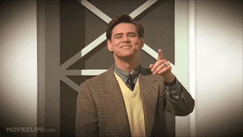
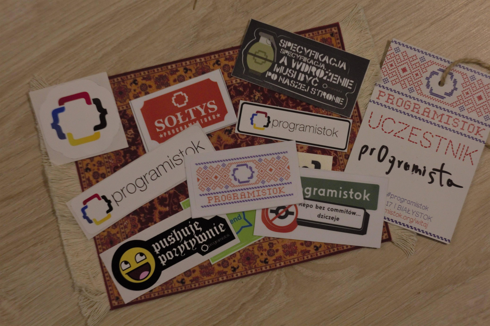

import { me, siteMetadata } from '@/lib/data';
import image from './programistok.jpg';

export const article = {
  date: '2017-10-18',
  title: 'Programistok 2017',
  description:
    'Podróż na Programistok 2017 i przygody z PKP po drodze.',
  author: me,
  image,
  lang: 'pl'
};

export const metadata = {
  title: article.title,
  description: article.description,
  author: { name: article.author.name },
  ...siteMetadata,
  keywords: ['podroz', 'konferencja'],
};

# Programistok 2017

Gdy przeprowadziłem się do Wrocławia myślałem, że to będzie koniec długich podróży. Pomyliłem się, stąd też ten post nie będzie stricte o Programistoku, ale bardziej o mojej wyczerpującej podróży.

### PKP
Ten wybór to był największy błąd. Orkan Ksawery, który przeszedł nad trasą jakiś dzień wcześniej mógł mieć na to wpływ. Jestem w stanie zrozumieć, że nie da się wszystkiego przewidzieć, ale to co się stało przechodzi ludzkie pojęcie.

<blockquote class="twitter-tweet" data-lang="pl">
PKP nie chce bym dojechał na programistok, coś kombinują <a href="https://t.co/tZSVJAHiJP">pic.twitter.com/tZSVJAHiJP</a>
&mdash; Bartosz Wiśniewski (@pr0gramista) <a href="https://twitter.com/pr0gramista/status/916294800663597057?ref_src=twsrc%5Etfw">6 października 2017</a></blockquote>

Pociąg przyjechał spóźniony, ale to była kwestia może 5 minut. Najpierw konduktor przechodzi i mówi "proszę nie wsiadać". Czekaliśmy jakieś kolejne 5 minut i już mogliśmy zająć miejsca. Usłyszeliśmy komunikat informujący, że pasażerowie podróżujący do Warszawy powinni opuścić pojazd i pojechać pociągiem ekspresowym na ten sam bilet. Było się wtedy ewakuować. 

Ruszyliśmy i w trakcie jazdy powiadomiono nas, że dojedziemy do Twardogóry (pogranicze Dolnego Śląska) i tam autobusami przetransportują nas do Ostrowa Wielkopolskiego (około 56 km, 55 min. jazdy). Dobra, 2h opóźnienia jeszcze przeżyje w końcu podstawią z 4 autobusy i jakoś to sprawnie pójdzie.

Autobus był 1 czy może 2 i tak na odjazd z Ostrowa czekałem jakieś 7h w tym czasie:
* Poczęstowano nas kawą (wow)
* Wskoczyłem do autobusu komunikacji zastępczej, ale nie przypisanej do naszego pociągu
* Zrobiłem w tym autobusie objazd po okolicznych wsiach
* Pilotowałem kierowcę na dworzec w Ostrowie
* Wypiłem piwko, bo Wars był już pusty...

<blockquote class="twitter-tweet" data-lang="pl">
Próba dotarcia na <a href="https://twitter.com/hashtag/programistok?src=hash&amp;ref_src=twsrc%5Etfw">#programistok</a>   update: przed chwilą pilotowałem autobus, ale wciąż jestem po niemieckiej stronie Polski WTF
&mdash; Bartosz Wiśniewski (@pr0gramista) <a href="https://twitter.com/pr0gramista/status/916386045197012992?ref_src=twsrc%5Etfw">6 października 2017</a></blockquote>

Ruszyliśmy o 23, gdzie o tej godzinie powinienem być już na miejscu. Myślałem, że już nic strasznego mnie nie spotka. Myliłem się.

### Bitwa o Autobus

Pan z obsługi pociągu policzył ilu z nas jedzie do Białegostoku i tak później usłyszeliśmy komunikat, że ten pociąg nie dojedzie do celu, ale za to podstawią nam na Warszawie Wschodniej autobusy. Właściwie to wszystko się sprawdziło tylko, że autobus był jeden. Na zewnątrz było chłodno, więc ludzie w tym ja szybko zajęliśmy miejsca, a do autobusu zbliżała się wycieczka szkolna podstawówki.

Nauczyciele walczyli o miejsca dla swoich podopiecznych. Jedni dumnie opuścili autobus, drudzy pokazywali jak ważny jest ich przejazd — Pani jedzie na pogrzeb, Pani wykupiła pierwszą klasę i ma cukrzycę a Pan musi jutro do pracy pójść a reszta po prostu czekała. 

Przyszła Pani z PKP i kazała opuścić pojazd i poczekać 3h na dworcu na pociąg, który zapewne będzie przepełniony. Pasażerowie nie dali się tak łatwo i po prostu odmówili. Trochę posiedzieliśmy i usłyszeliśmy, że za chwilę przyjedzie taksówka klasy biznes i kto chce pojechać to niech wysiądzie. Pamiętając moją poprzednią przygodę z autobusem postanowiłem wyjść i moim oczom ukazała się owa taksówka, tuż za autobusem. Szczęśliwy wsiadłem i dojechałem do Białegostoku!

### Zakwaterowanie
Moja przygoda z Białymstokiem zaczęła się od dworca kolejowego skąd musiałem dotrzeć na konferencje lub do mojego zakwaterowania — Willa Mamycięgdzieśrella. Zmęczony poczułem szczęście przekraczając próg drzwi tej willi. Pani za ladą jednak szybko ostudziła moją radość i stwierdziła, że moja rezerwacja jest już nieważna, bo się nie pojawiłem na miejscu a oni pokoi już nie mają.

> PKP ma ogromne opóźnienia i najprędzej pojawię się w Białymstoku o 6 rano.

Pani się zdziwiła czemu się z nimi nie skontaktowałem, odpowiedź: bo nie sprawdzacie bookingu. Maila im wysłałem, dzwonić w pociągu pełnym śpiących ludzi nie będę a nawet ochoty na to nie miałem. Ba! Rezerwacje miałem na dwie noce. Usiadłem i ponownie zarezerwowałem pokój przez booking (?).

Czy ktoś wie jak booking działa? Bo to pierwszy raz, żebym się spotkał z takimi problemami.

### Programistok
Mam takie odczucie, że Programistok chce być taką niezależną, kameralną, studencką konferencją i to im się udaje. Zgaduję, że organizatorzy odrzucali sporo ofert sponsoringu ze względu na reklamę jakiej oczekiwali. Warto też dodać, że programistok jest organizowany w formie non-profit.

Prezentacje były świetne! Jedna dobra ścieżka zrobiła robotę. Najciekawsze były dla mnie lighting talki, czyli krótkie 5 minutowe wystąpienia. Najgorsza dla mnie była prezentacja o temacie "Znajdź swoje korzenie - dziedziczenie w JavaScript", ale prawdopodobnie tylko dlatego, że to zagadnienie już znałem.

Oczywiście nie można zapomnieć o giftach!

*Koszulki, super podkładka pod mysz i naklejki*

### Powrót
Znalazłem jakiś hostel, poszedłem kupić nowe słuchawki (te kupione na ten wyjazd zgubiłem zapewne w trakcie akcji w Twardogórze) i tak pozwiedzałem trochę Białegostoku. Na aftera już sił nie miałem, w końcu 28h na nogach nie napawa do imprezowania.

Powrót do Wrocławia przebiegł rewelacyjnie. Pociąg i samolot na czas — 5h podróży.

### EOF
Tak jak wspomniałem we wstępie nie mam pełnego obrazu na programistok. Naprawdę żałuję, że nie byłem ani na beforze ani na afterze. Do Białegostoku przez następne kilka lat nie pojadę, ale event szanuję.

Na końcu wrzucam vlog jednego z znanych prelegentów :)
<iframe width="560" height="315" src="https://www.youtube.com/embed/-6jS3qcnMfA?rel=0" frameborder="0" allowfullscreen></iframe>

